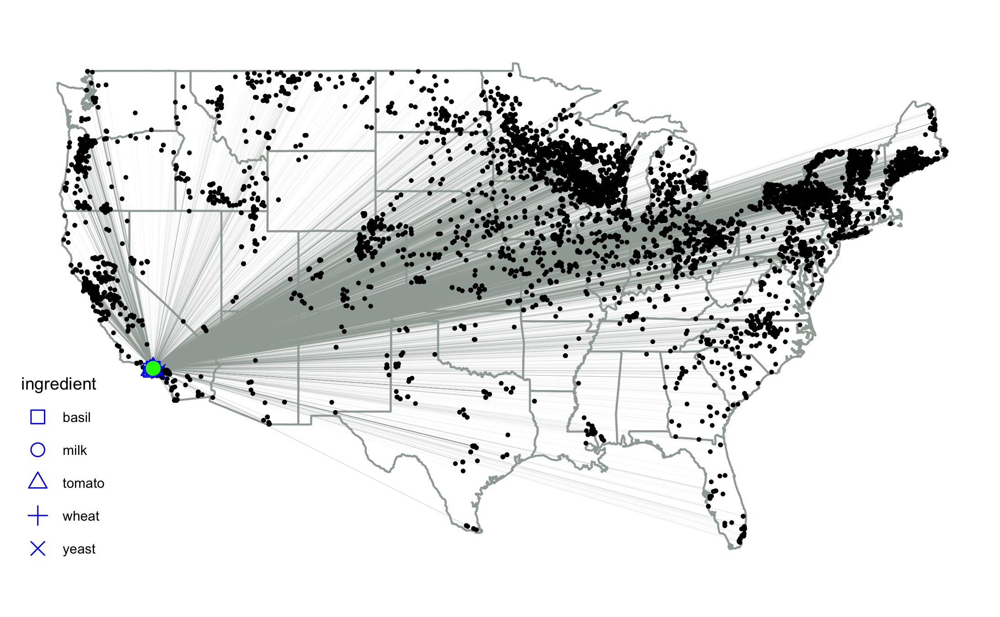
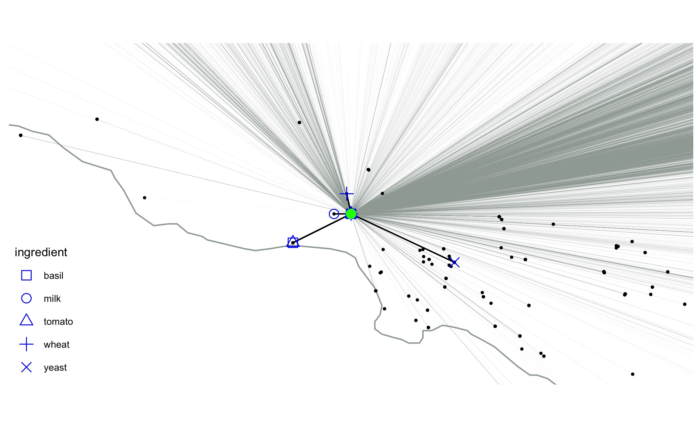
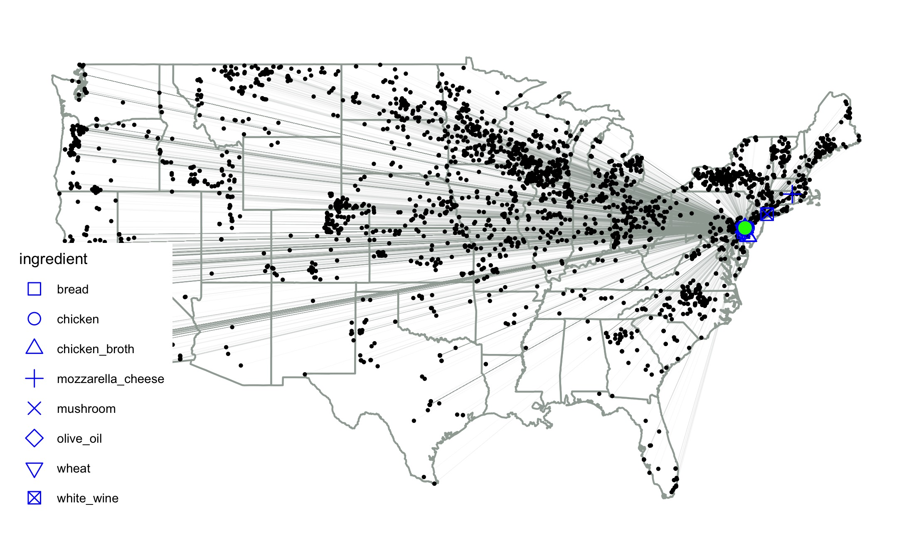
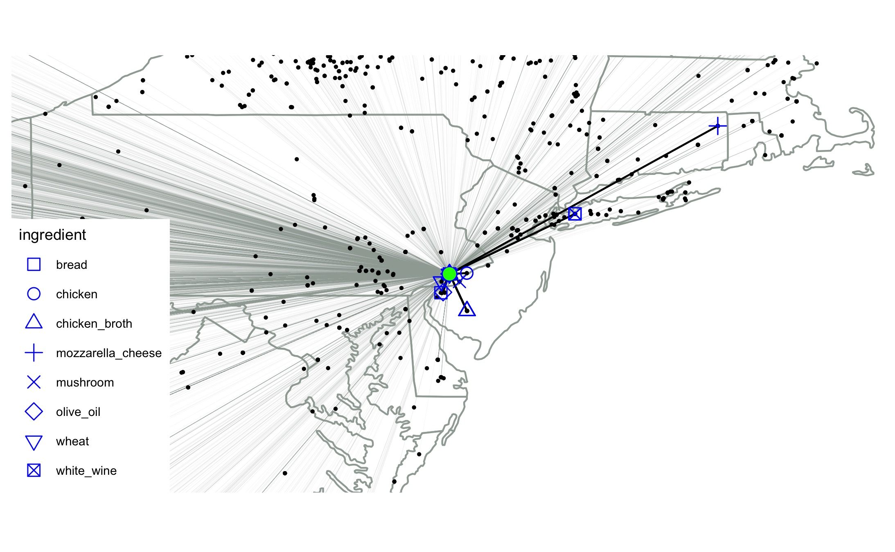

## Load Libraries

```r
  library(RJSONIO)
  library(ggplot2)
  library(cowplot)
  library(GGally)
  library(RCurl)
  library(magick)
  library(readxl)
  library(RMySQL)
  library(reshape)
  library(network)
  library(statnet)
  library(gganimate)
  library(ggthemes)
  library(beepr)

  set.seed(8888)
```

## Load and prepare data
## 1A. Organic producers (Integrity Database. USDA)
 This code loads and cleans the data. 
 Subsequequently it searches for the latitude and longitude using the google maps API
 This will only work with your own google maps KEY. Make sure to use that one. Else you can skip this step and load the data which contains the latitude and longitude. Next step.
 

```r
#Get GPS coordinates for every organic operaration in the US
#1. Import operation level
opall <- as.data.frame(read.csv(paste0(directx,"op.csv"),stringsAsFactors = FALSE))
#2. Import item level
itall <- as.data.frame(read.csv(paste0(directx,"it.csv"),stringsAsFactors = FALSE))
getwd()
dim(opall)
dim(itall)

#3: Merge Operation and item levels
lsallall<-merge(opall, itall, by.x="op_nopOpID", by.y="ci_nopOpID", all.y = TRUE)

#send to SQL
conn <- dbConnect(RSQLite::SQLite(), dbname="organics.sqlite")
dbWriteTable(conn, value = lsallall, name = "allorganicoperations", overwrite = FALSE) 
alloperations<-dbGetQuery(conn, "
                      SELECT A. *
                      FROM allorganicoperations A
                      WHERE TRIM(A.opPA_country) IN ('United States of America (the)')
                      ")
dbWriteTable(conn, value = alloperations, name = "USAorganicoperations", overwrite = FALSE)
geocodeAdddress<- function(address) {
  require(RJSONIO)

  
  url <- URLencode(paste0(url, address,keystuff, sep = ""))
  x <- fromJSON(url, simplify = FALSE)
  if (x$status == "OK") {
    out <- c(x$results[[1]]$geometry$location$lng,
             x$results[[1]]$geometry$location$lat)
  } else {
    out <- matrix(nrow=2,ncol=1)
  }  out-
}


#Create vector with all the address values
alloperations$opadresscom <- paste(alloperations$opPA_line1 , alloperations$opPA_line2 , alloperations$opPA_city , alloperations$opPA_state , alloperations$opPA_country , alloperations$opPA_zip, sep=" ")
#clean
alloperations$opadfinal<-gsub("[^0-9\\.\\^A-Z\\^a-z\\ ]", "", alloperations$opadresscom)
#Use function, get latitude and longitude from google maps
#You will need to re run this several times, excluding those for which you were able to get coordinates. Again, it is important to register for the google maps API so you don't run over the limit og queries. 
#head(alloperations)
#dim(alloperations)

alloperations<-read.csv("/Users/juan/Dropbox/ACADEMICO/NYU PHD/Y2/Independent Study/Organic/food_journal/alloperations.csv")
geovector<-as.data.frame(alloperations$opadfinal)
#dim(geovector)
geovector<-unique(geovector)
#dim(geovector)

#dim(alloperations)

preurl <- "https://maps.googleapis.com/maps/api/geocode/json?address="
###### WARNING: USE YOUR OWN GOOGLE MAPS API KEY HERE:
keystuff <- "YOUR GOOGLE MAPS API KEY HERE"

geovector$lat<--999
geovector$lon<--999
head(geovector)
dim(geovector)
for(i in 10001:15629)
{
  url<-URLencode(paste0(preurl, as.character(geovector[i,1]),keystuff, sep = ""))
  x <- fromJSON(url, simplify = FALSE)

  if (x$status == "OK") {
    geovector[i,2]<-as.numeric(x$results[[1]]$geometry$location$lat)
    geovector[i,3]<-as.numeric(x$results[[1]]$geometry$location$lng)
  } else {
    geovector[i,2]<--888
    geovector[i,3]<--888
  } 
}


#write.csv(geovector,"geovector.csv")
#isitgoodornot <- read.csv("geovector.csv") 

xx<-URLencode(paste0(url, as.character(geovector[i,1]),keystuff, sep = ""))

for(i in 1:1)
{
  lxxx <- paste(t(paste0(print(geocodeAdddress(geovector[i,1])))),sep="xxx")
  lxxx<-as.data.frame(t(lxxx))
  lxxx[1,3]<-paste(lxxx[1,1],lxxx[1,2],sep="xxx")
  lxxx
  geovector[i,2] <- (lxxx[1,3])
}
#head(geovector)
write.csv(alloperations, "alloperations.csv")
```

## 1B. Organic producers (Integrity Database. USDA)
This code loads and merges the geocoded data.At the end of this code you will get the final dataset of organic production in the USA


```r
#load geocoded data
geovector <- read.csv("/Users/juan/Documents/GitHub/SustainableCooking-Source_Local_and_Organic/geovector.csv", stringsAsFactors = FALSE)
#head(geovector)

#load merged USDA'a integrity database dataset
data <- read.csv("/Users/juan/Documents/GitHub/SustainableCooking-Source_Local_and_Organic/alloperations.csv")
#head(data)
#dim(data)

#merge
production_data<-merge(data, geovector, by.x="opadfinal", by.y="alloperations.opadfinal", all.x = TRUE)

#subset
production_data <- subset(production_data, select = c(opadfinal, ci_nopCategory, ci_nopCatName, ci_itemList, lat, lon))

#check merge accuracy
#dim(geovector)
#dim(data)
#head(production_data)
#dim(production_data)
#table(is.na(production_data$lat))
```

## 2B Load Recipe Dataset from The Flavor Network. 

```r
recipes <- read.csv("/Users/juan/Documents/GitHub/SustainableCooking-Source_Local_and_Organic/allr_recipes.csv", stringsAsFactors = FALSE)
#dim(recipes)
#table(recipes$region)
#subset so only American recipes remain in the dataset
recipes <- subset(recipes, region == "American")
#dim(recipes)
```


## 2C Load Whole Foods Supermarket Locations

```r
#See here for how to obtain this dataset: https://github.com/juancsherrera/wholefoods
whole_foods <- read.csv("/Users/juan/Documents/GitHub/SustainableCooking-Source_Local_and_Organic/wf_geo_public.csv", stringsAsFactors = FALSE)
#head(whole_foods)
```

## Map Producers and Whole Foods (random coordinates)

```r
#Load base map
usa <- map_data("state")

#1. ORGANIC PRODUCERS
#Prune so ONLY the 48 CONTIGUOUS US STATES REMAIN
fig1tot<-production_data[production_data$lat>20,]
fig1tot<-fig1tot[fig1tot$lat<55,]
fig1tot<-fig1tot[fig1tot$lon>-125,]
fig1tot<-fig1tot[fig1tot$lon< 1*(-50),]
#CREATE NEW DATSET WITH ONLY 48 CONTIGUOUS US STATES
production_data_48 <- fig1tot
#create vector of products in the USDA OID
production_data_48$productvector<-(paste(                
  tolower(gsub("[^[:alnum:]]","", production_data_48$ci_nopCategory)),
  tolower(gsub("[^[:alnum:]]","", production_data_48$ci_nopCatName)),
  tolower(gsub("[^[:alnum:]]","", production_data_48$ci_itemList))
))

#2. WHOLE FOOD SUPERMAKETS
#prune so only contiguos US states appear
whole_foods_48<-whole_foods[whole_foods$lat>20,]
whole_foods_48<-whole_foods_48[whole_foods_48$lat<55,]
whole_foods_48<-whole_foods_48[whole_foods_48$lon>-125,]
whole_foods_48<-whole_foods_48[whole_foods_48$lon< 1*(-50),]

#MAPPING HERE!
#Large size
theme_base(base_size = 3000)
```

```r
#draw the USA map with state lines
fig1fig <- ggplot() + geom_polygon(data = usa, aes(x=long, y = lat, group = group), fill = "white", color = "#9fa9a3") + coord_fixed(1.3) 
#add organic producer nodes
fig1fig <- fig1fig + geom_point(data = fig1tot, aes(x = lon, y = lat), size = 0.0005) 
#add Whole food supermarkets in another color
fig1fig <- fig1fig + geom_point(data = whole_foods_48, aes(x = lon, y = lat), size = 0.5, color = "green") #add nodes
fig1fig <- fig1fig + theme_map()
fig1fig
```

<!-- -->

```r
ggsave("/Users/juan/Documents/GitHub/SustainableCooking-Source_Local_and_Organic/production_data_USA.eps")
ggsave("/Users/juan/Documents/GitHub/SustainableCooking-Source_Local_and_Organic/production_data_USA.jpg")

c(paste0("Organic Production in the USA.Number of Producers: ",as.character(as.matrix(dim(as.data.frame(unique(fig1tot$opadfinal))))[1,1])))
```

```
## [1] "Organic Production in the USA.Number of Producers: 15490"
```


## Problem 1: Find recipe ingredients given a GPS coordinate and a recipe

```r
# 1. select random recipe row from recipe dataset
random_recipe <- recipes[sample(nrow(recipes), 1), ]
#random_recipe

# 1. select random GPS coordinate. We are using a dataset of Whole Foods locations
random_wf<- whole_foods[sample(nrow(whole_foods), 1), ]
#random_wf

#Create Functions for calculating Haversine distances
# Calculates the geodesic distance between two points specified by radian latitude/longitude using the
deg2rad <- function(deg) return(deg*pi/180)
# Haversine formula (hf)
haversine <- function(long1, lat1, long2, lat2) {
  R <- 6371 # Earth mean radius [km]
  delta.long <- (long2 - long1)
  delta.lat <- (lat2 - lat1)
  a <- sin(delta.lat/2)^2 + cos(lat1) * cos(lat2) * sin(delta.long/2)^2
  c <- 2 * asin(min(1,sqrt(a)))
  d = R * c
  return(d) # Distance in km
}
haversine <- Vectorize(haversine, SIMPLIFY = F)

#head(binder)
#drop(binder)
#drop(finaldatabase)

binder<-as.data.frame(production_data_48[0,])
#dim(random_recipe)

for(i in 2:31)
{
  if (random_recipe[1,i] != "")
      {
        ingredients_i<-random_recipe[1,i]
        item<- gsub("_","",random_recipe[1,i])
        binder<-subset(production_data_48, grepl(item,production_data_48$productvector, fixed = T))
        binder$wf_lon<-as.numeric(random_wf$lon)
        binder$wf_lat<-as.numeric(random_wf$lat)
        binder$distance<-as.numeric(unlist(haversine(deg2rad(binder$wf_lon),deg2rad(binder$wf_lat),deg2rad(binder$lon),deg2rad(binder$lat))))
        binder[order(binder$distance),]
        binder$ingredient<-random_recipe[1,i]
        binder$min_dist<-min(binder$distance)
        if (i == 2)
        {
          finaldatabase <- binder
        }
        if (i > 2)
        {
          finaldatabase <- rbind(finaldatabase,binder)
        }
        drop(binder)
      }
}

#dim(finaldatabase)
mindist_finaldatabase<-subset(finaldatabase,finaldatabase$distance==finaldatabase$min_dist)
#table(mindist_finaldatabase$ingredient,mindist_finaldatabase$lat)
#head(random_recipe)
#dim(mindist_finaldatabase)
#colnames(mindist_finaldatabase)
```

## Problem 1: Visualize the Findings

```
## [1] 6797
```

<!-- -->

<!-- -->


<!-- -->

<!-- -->

```
##    mindist_finaldatabase$ingredient
## 1                         olive_oil
## 2                         olive_oil
## 3                 green_bell_pepper
## 4                             onion
## 5                             onion
## 6                       cauliflower
## 7                           vinegar
## 8                           vinegar
## 9                      black_pepper
## 10                           carrot
## 11                         cucumber
## 12                      bell_pepper
## 13                      bell_pepper
## 14                         broccoli
##                                                                             supplier
## 1        3133 Industrial Drive  Freeport Illinois United States of America the 61032
## 2        3133 Industrial Drive  Freeport Illinois United States of America the 61032
## 3           9826 East 3000N Rd.  Momence Illinois United States of America the 60954
## 4                 28485 W 119th St  Olathe Kansas United States of America the 66061
## 5                 28485 W 119th St  Olathe Kansas United States of America the 66061
## 6         12459 Elm Branch Road  Windsor Missouri United States of America the 65360
## 7  6400 Collinsville Road  Fairmont City Illinois United States of America the 62201
## 8  6400 Collinsville Road  Fairmont City Illinois United States of America the 62201
## 9               104 Route CC  Greenfield Missouri United States of America the 65661
## 10                1103 Blake  Edwardsville Kansas United States of America the 66111
## 11              7565 Edgerton Rd.  De Soto Kansas United States of America the 66018
## 12      2930 Terrace Street  Kansas City Missouri United States of America the 64108
## 13      2930 Terrace Street  Kansas City Missouri United States of America the 64108
## 14      2930 Terrace Street  Kansas City Missouri United States of America the 64108
##                                                                                                                                                                                                                                         product_offered_by_supplier
## 1                                                                                                                                                                                                                                                Popcorn, Olive Oil
## 2                                                                                                                                                                                                                                            Popcorn with Olive Oil
## 3                                                                                                                                                                                                                        Green Bell Pepper Roasted IQF/Frozen 510.9
## 4                                                                                                                                                                                                                                              Diced Organic Onions
## 5                                                                                                                                                                                                                                              Diced Organic Onions
## 6                                                               Asparagus, Broccoli, Cabbage, Cantaloupe, Cauliflower, Celery, Chives, Corn, Cucumber, Kale, Lettuce, Marjoram, Oats, Parsley, Pasture, Pepper, Summer Squash, Sunflower, Thyme, Tomato, Watermelon
## 7                                                                                                                                                                                                                                 Homestyle Vinegar Flavor (Winter)
## 8                                                                                                                                                                                                                                 Homestyle Vinegar Flavor (Summer)
## 9        Pizza My Heart with Kale and Mustard, Black Pepper with Kale and Mustard, Himalayan Pink Salt with Kale, Garlic with Kale, Onion with Kale, Taco Tuesday with Kale, Seasoning Pepper with Kale and Mustard, Seasoning Salt with Kale, Taco Tuesday Single.
## 10                                                                                                                                                                                                                                                          Carrots
## 11                                                                                                                                                                                                                                  Fruit Vegetables   Cucumbers   
## 12                                                                                                                                                                                                                                              Bell Pepper - Green
## 13                                                                                                                                                                                                                                                Bell Pepper - Red
## 14                                                                                                                                                                                                                                                         Broccoli
##    distance_in_miles total_food_miles
## 1         356.691345         1256.604
## 2         356.691345         1256.604
## 3         407.325750         1256.604
## 4           8.609841         1256.604
## 5           8.609841         1256.604
## 6          74.771521         1256.604
## 7         253.981668         1256.604
## 8         253.981668         1256.604
## 9         115.381868         1256.604
## 10         10.584425         1256.604
## 11         15.202466         1256.604
## 12         14.054889         1256.604
## 13         14.054889         1256.604
## 14         14.054889         1256.604
```
```


## Problem 2: Local Recipe Recommendation System

```r

